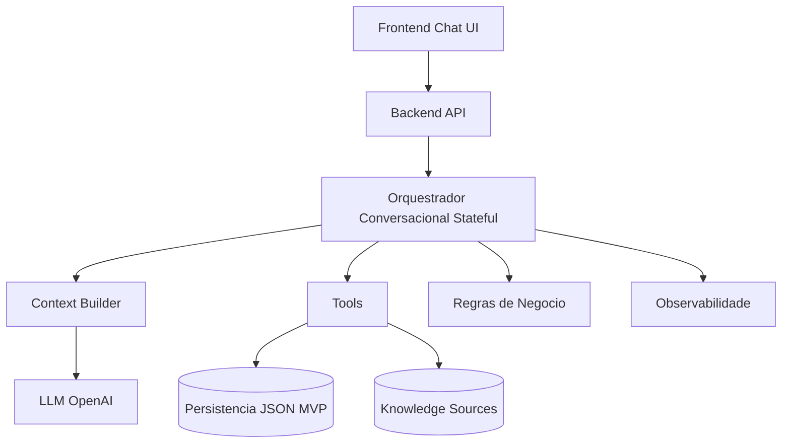

# Sistema de Agente de IA para Pré-Atendimento e Qualificação de Leads

## 1. Diagrama de arquitetura

## 2. Fluxo conversacional

1. Abertura
2. Identificacao de intencao
3. Descoberta
4. Coleta de dados
5. Qualificacao
6. Resolucao de duvidas
7. Encaminhamento
8. Encerramento ou handoff

Regras aplicadas no MVP:

- Fluxo guiado com linguagem natural.
- Evita repeticao de coleta usando `nextMissingField`.
- Permite desvio para duvidas quando mensagem e pergunta.
- Handoff via regra de negocio (`shouldHandoff`).

## 3. Modelo de dados (persistencia MVP)

Entidades implementadas em `data/conversations.json`:

- `sessions`
- `messages`
- `leads`
- `lead_states`
- `tool_calls`
- `events`
- `knowledge_sources`
- `eval_results`

## 4. Estrutura de estado do lead

Campos implementados:

- `session_id`, `lead_id`
- `nome`, `telefone`, `email`, `cidade`
- `intencao`, `produto_interesse`
- `orcamento`, `prazo`, `forma_pagamento`, `possui_troca`
- `estagio`, `score`, `classificacao`, `proximo_passo`
- `resumo_conversa`, `consentimento`
- `created_at`, `updated_at`
- `dados_confirmados`, `dados_inferidos`

## 5. Plano de contexto

Payload controlado enviado ao LLM:

- `prompt_version`
- `session` (id, stage, updated_at)
- `lead_summary`
- `lead_state` enxuto
- `next_missing_field`
- `retrieved_knowledge`
- `recent_messages` (ultimas 8)

## 6. Definicao de tools

Tools implementadas:

- `salvar_lead`
- `atualizar_lead`
- `classificar_lead`
- `consultar_base_conhecimento`
- `acionar_handoff`
- `registrar_evento`
- `consultar_agenda` (stub para fase futura)

Padrao aplicado:

- Input/output estruturado.
- Logging em `tool_calls`.
- Tratamento de erro por tool.

## 7. Plano de RAG (MVP)

Fonte atual:

- `knowledge_sources` local com FAQ, institucional e playbook.

Pipeline MVP:

1. Ingestao manual de fonte no store.
2. Recuperacao por score lexical de tokens.
3. Retorno de ate 3 itens para contexto.

Evolucao recomendada:

- Chunking + embeddings.
- Index vetorial.
- Re-ranking e filtros por tipo de fonte.

## 8. Regras de negocio formalizadas

Implementadas fora do LLM:

- Score de qualificacao.
- Classificacao (`frio`, `morno`, `quente`).
- Definicao de estagio.
- Definicao de proximo passo.
- Regras de handoff.

## 9. Observabilidade

Logs estruturados persistidos:

- evento de entrada do usuario
- evento de recuperacao de conhecimento
- evento de resposta do assistente
- encerramento de turno com latencia e versao de prompt
- tool calls com status/latencia/erro

## 10. Evals

Estrutura criada:

- entidade `eval_results` pronta para registrar execucoes.

Suite inicial recomendada (proximo passo):

1. Cenarios de coleta completa.
2. Cenarios com dados incompletos.
3. Deteccao de duvida fora de escopo.
4. Consistencia da classificacao.
5. Validacao de acionamento de handoff.

## 11. Roadmap tecnico

Fase 1 (implementada):

- chat funcional
- orquestrador stateful basico
- estado estruturado persistente
- tools obrigatorias (agenda em stub)
- logs de eventos e tool calls

Fase 2:

- RAG vetorial
- integracao CRM
- regras avancadas de elegibilidade/scoring
- eval suite automatizada

Status da Fase 2 (implementado nesta iteracao):

- RAG hibrido lexical + embeddings (`server/rag.js`).
- endpoint de ingestao incremental de fontes (`POST /api/knowledge-sources`).
- sincronizacao com CRM via webhook (`server/crm.js`) quando lead quente + consentimento.
- observabilidade com metricas operacionais (`GET /api/metrics`).
- evals executaveis por API (`POST /api/evals/run` e `GET /api/evals/latest`).

Fase 3:

- multiempresa
- segmentacao por playbook
- otimizacao de custo/latencia
- automacoes comerciais
